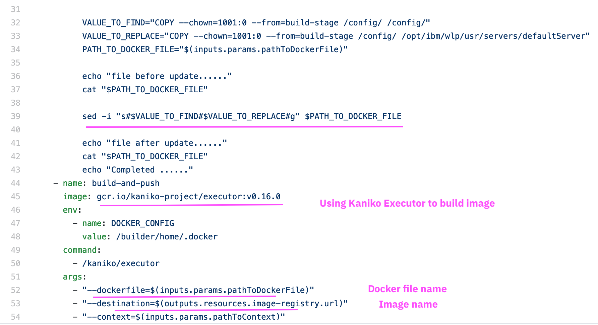

# Installing Tekton Pipeline for Transformation Advisor generated Liberty Artifacts

TA generates migration artifacts (`liberty operator manifest files`, `dockerfile`, pom.xml and etc) to deploy the assessed app in Kubernetes platform.

Using Tekton, we build docker image with the TA generated artifacts and deploy the app in RedHat Openshift Container Platform. To do that the below resources are created and available in this repo.
1. Pipeline
2. Task
3. Secret
4. ServiceAccount
5. ClusterRole

Here `Task` contains steps to create docker image and push it to Docker Registry and deploy in Openshift. These resources are fully customized for TA generated Liberty artifacts.

These resources are installed in Openshift as a Tekton pipeline. 

Then webhook in the Tekton to be created to link this Pipeline with the GIT repo installed pipeline can be used to deploy any number of apps (TA generated).

Then this Tekton pipeline can be associated in every webhook that we create in Tekton.

Lets install the pipeline and understand its resources.

## Prerequisites

* Cloud Pak for Applications v4.x installed on Openshift cluster v4.2 (make sure that Tekton is installed)
* oc CLI

## Installing Tekton pipeline `ta-liberty-pipeline`

This will install the pipeline under the namespace `ta-liberty-pipeline-pro`. (To have different namespace,  the yaml filess available in `src` folder have to be modified accordingly).

Here are the steps to install this pipeline in RHOCP.

### Installation Steps

1. Download the source code of this repo. 

2. Open the command prompt and get into `install` folder.

```
cd tekton/001-tekton-tranformationadvisor-liberty/ta-liberty-pipeline/install
```

3. Modify the GIT and Docker secrets available in the files.

* 02-docker-secret.yaml
* 03-git-secret.yaml

4. Login into your Redhat Openshift Container Platform like below

```
oc login --token=NIqa12ewuV2AR-ZTAbG0v --server=https://api.ganwhite.os.fyre.ibm.com:6443
```

5. Run the `01-install.sh` to install the pipeline.

```
sh 01-install.sh
```

## Pipeline manifest files

The manifest files required to install this pipelines are discussed here.

### Contents

This pipeline is installed under the namespace `ta-liberty-pipeline-pro`.

The manifest files contains the following

* Namespace
* Docker and GIT secrets
* Service Account
* Task
* Pipeline


### 1. Namespace

* This pipeline is installed under the namespace `ta-liberty-pipeline-pro`.


### 2. Secret - Docker

* Docker secret is available in this file.
* Docker secret is labeled with the service account.


### 3. Secret - git

* GIT secret is available in this file.
* GIT secret is labeled with the service account.


### 4. Service Account

* It creates a ServiceAccount
* It links the ServiceAccount with Docker and GIT secrets
* Creates ClusterRoleBinding between a ClusterRole called ClusterAdmin and the ServiceAccount


### 5. Task - Build Docker Image

This task download the source code from the GIT repo, build the docker image and push the image to the docker hub repository using Kaniko Executor Project.

* It takes GIT Repo as Input resource  (This GIT will be coming from the Webhook)
* It takes Docker file location as a input param 
* It produce Docker Image as Output resource (Docker image name is decided based on the GIT repo name automatically)

* It will pull the source code from the GIT Repo
* First it replaces the symbolic link mentioned in the Dockerfile (workaround - as Kaniko used to build the image will not support symbolic link)
* Creates Docker image using Kaniko Executor Project.
* Push the image to the Docker hub registry




### 6. Task - Deploy in Openshift using Kubectl

This tasks apply the deployment manifest files in the RHOCP using the kubectl commands.

* It takes GIT Repo and Docker Image as Input resource 
* It takes Deployment file location as a input param 

* It will parse the Image Name and Image Tag from the Docker Image input
* Updates the application-cr.yaml with this Image Name and Tag.
* Deploy the deployment manifest files using Kubectl apply through the lachlanvenson project


### 7. Pipeline

This pipeline will be called by the webhook in tekton, whenever there is a push into the associated GIT.

* It takes GIT Repo and Docker Image as resources
* It takes Docker file location  and Deployment file location as a input params

* It will call the above created 2 tasks as part of running this pipeline.


